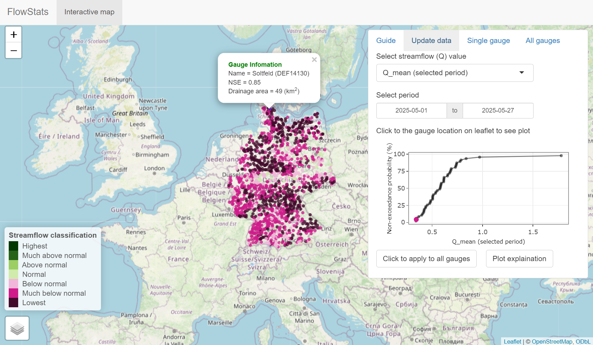

### About FlowStats

- This is an R package (with Graphical User Interface - GUI) for near real time streamflow statistical analysis (1-day delay) using Long-Short-Term Memory (LSTM) rainfall-runoff model and near-real-time meterological data ([daily precipitation, temperature, and relative humidity](https://opendata.dwd.de/climate_environment/CDC/grids_germany/daily/hyras_de/)) from the German Weather Service (DWD).
- The LSTM model achieves a median NSE of 0.8 on the test period (2010–2020) across 1,566 basins in the [CAMELS-DE](https://essd.copernicus.org/articles/16/5625/2024/essd-16-5625-2024.html) dataset.
- The simulated streamflow data (01.1980 - 5.2015) are used as default for statistical streamflow analysis (this data can be updated to get near real time streamflow data).

### Installation

```R
# Install FlowStats from github
install.packages("remotes")
remotes::install_github("tamnva/FlowStats", force = TRUE, dependencies = TRUE)

# Load FlowStats and Show FlowStats graphical user interface
library(FlowStats)
show_flowstats()
```

### FlowStats GUI

The figure below shows the median streamflow in May 2025 compared to the mean streamflow in all years from 1980–2025. Many gauges had the lowest mean streamflow, while most other gauges fell into the “much below normal” category. Streamflow classification is adapted from the [USGS WaterWatch](https://waterwatch.usgs.gov/index.php?id=ww_current). The figure on the right panel shows the mean streamflow of the selected station in May 2025 and the mean streamflows of this station during the same period in other years.

<p align="center">
  
</p>