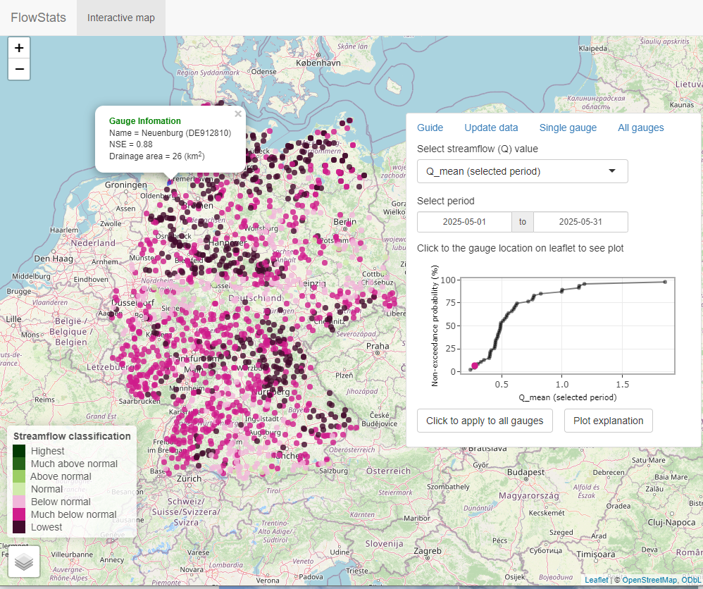
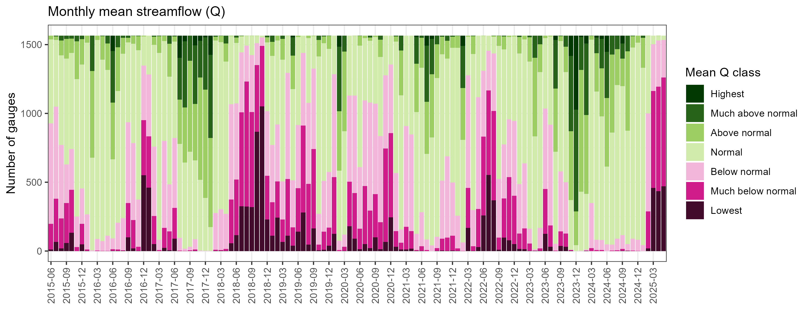

### About FlowStats
[](https://doi.org/10.5281/zenodo.15571345) [](https://github.com/tamnva/FlowStats/actions/workflows/R-CMD-check.yaml)

- This is an R package (with Graphical User Interface - GUI) for near real time streamflow statistical analysis (1-day delay) using Long-Short-Term Memory (LSTM) rainfall-runoff model and near-real-time meterological data ([daily precipitation, temperature, and relative humidity](https://opendata.dwd.de/climate_environment/CDC/grids_germany/daily/hyras_de/)) from the German Weather Service (DWD).
- The LSTM model achieves a median NSE of 0.8 on the test period (2010–2020) across 1,566 basins in the [CAMELS-DE](https://essd.copernicus.org/articles/16/5625/2024/essd-16-5625-2024.html) dataset.
- The simulated streamflow data (01.1980 - 5.2025) are used as default for statistical streamflow analysis (this data can be updated to get near real time streamflow data).

### Installation

```R
# Install FlowStats from github
install.packages("remotes")
remotes::install_github("tamnva/FlowStats", force = TRUE, dependencies = TRUE)

# Load FlowStats and Show FlowStats graphical user interface
library(FlowStats)
showFlowStats()
```

### FlowStats GUI

Figure 1 shows the mean streamflow in May 2025 compared to the mean streamflow in all years from 1980–2025 and mean streamflow in other months compared to all other months in all years. In May 2025, around 500 gauges had the lowest mean streamflow, while most other gauges fell into the “much below normal” category (Figures 1 & 2). Streamflow classification is adapted from the [USGS WaterWatch](https://waterwatch.usgs.gov/index.php?id=ww_current).

<p align="center">
  
</p>
Figure 1. Mean streamflow in May 2025 is compared to the mean streamflow in May across the years 1980–2025. The comparison is expressed in terms of percentiles, following [USGS classification scheme](https://waterwatch.usgs.gov/?id=ww_current).

<p align="center">
  
</p>
Figure 2. Monthly mean streamflow compared to the mean streamflow of the corresponding months across the years 1980–2025. For example, the last column in this figure represents the mean streamflow in May 2025 compared to the mean streamflow in May of other years (1980–2025), as shown in Figure 1.
