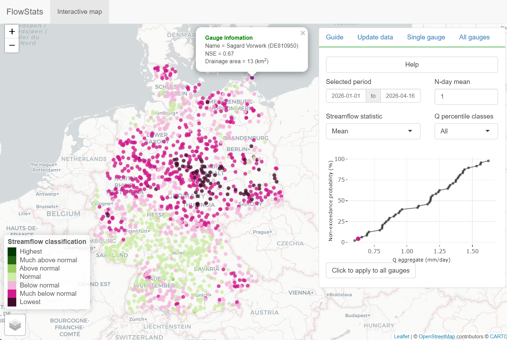
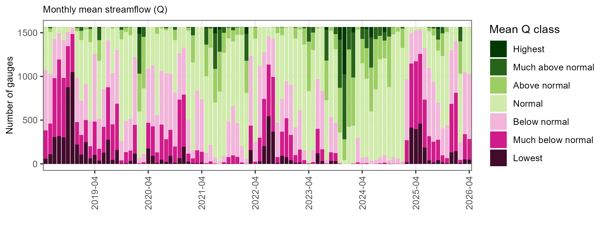

### About FlowStats
[](https://doi.org/10.5281/zenodo.15571345) [](https://github.com/tamnva/FlowStats/actions/workflows/R-CMD-check.yaml)

- This is an R package (with Graphical User Interface - GUI) for stream**Flow** visualization and **Stat**istical analyse**s** (real-time and forecast up to 5 day in advance) using the Long-Short-Term Memory (LSTM) rainfall-runoff model and meteorological data ([daily precipitation, temperature (min & max), and relative humidity](https://opendata.dwd.de/climate_environment/CDC/grids_germany/daily/hyras_de/)) from the German Weather Service (DWD).
- The LSTM model achieves a median NSE of 0.860 on the test period (2011–2020) across 1,566 basins in the [CAMELS-DE](https://essd.copernicus.org/articles/16/5625/2024/essd-16-5625-2024.html) dataset.
- The simulated streamflow data (01.1980 - 4.2026) are used as default for statistical streamflow analyses (this data can be updated to get real time and forecast streamflow data). 

Citation: Duong, T.D., Tran, V.N. & Nguyen, T.V. Near-Real-Time Statistical Analysis and Visualization of Streamflow from a Deep-Learning Rainfall-Runoff Model. Water Resour Manage 40, 221 (2026). https://doi.org/10.1007/s11269-026-04602-6

### Installation

```R
# Install FlowStats from github
install.packages("remotes")
remotes::install_github("tamnva/FlowStats", force = TRUE, dependencies = TRUE)

# Load FlowStats and Show FlowStats graphical user interface
library(FlowStats)
showFlowStats()
```

### FlowStats GUI

Figure 1 shows the mean streamflow during January 1 to April 17, 2026 compared to the mean streamflow during the same period since 1980. Central and northern Germany are experiencing low-flow conditions (much below to the lowest level since 1980). In contrast, most of southern Germany shows streamflow conditions within the normal range. Streamflow classification is adapted from the [USGS WaterWatch](https://waterwatch.usgs.gov/index.php?id=ww_current).

<p align="center">
  
</p>
Figure 1. Mean streamflow during January 1 to April 17, 2026.

<p align="center">
  
</p>
Figure 2. Monthly mean streamflow compared to the mean streamflow of the corresponding months across the years 1980–2026. For example, the last 2 columns in this figure represents the mean streamflow in March and April 2026 compared to the mean streamflow in March and April of other years (1980–2026).
